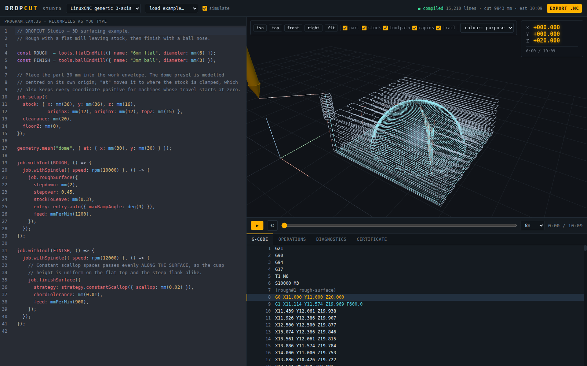

# DROPCUT Studio

A browser CAM application that turns JavaScript into verified CNC machine code.

Write a machining program in a sandboxed JavaScript DSL; get toolpaths, a 3D
simulation, a material-removal check and dialect-specific G-code — with a safety
certificate that states what was actually verified and at what resolution.



## The idea

> Do not make G-code the semantic model. Make machining the semantic model, and
> treat G-code as one serialization backend.

G-code is *modal*: settings persist until changed, so a line reading `X70` means
"rapid to 70", "feed to 70 at 800 mm/min", or "move 70 further" depending on
lines that may be thousands of blocks earlier. Any intermediate representation
that inherits that property inherits the hazard.

So the pipeline runs the other way from a typical postprocessor. Machining
semantics are constructed first, non-modally, and modality is reintroduced only
as a compression pass at the very end:

```
script → ManufacturingPlan → ToolpathProgram → CanonicalProgram
       → MachineProgram → ValidatedProgram → GCodeBlock[] → .nc
```

Every stage is a value you can inspect. Simulation, time estimation,
verification, visualisation and the emitted program are all interpretations of
the *same* object rather than separate re-derivations from text.

## Try it

```bash
pnpm install

# the application
pnpm --filter @studio/app dev

# or headless
pnpm dropcut example surface-finish -o program.js
pnpm dropcut compile program.js -m linuxcnc -o out.nc
pnpm dropcut compile program.js -m makera-z1 -o makera.nc   # same program, different machine
pnpm dropcut check out.nc
```

A program looks like this:

```js
const ROUGH  = tools.flatEndMill({ name: "6mm flat", diameter: mm(6) });
const FINISH = tools.ballEndMill({ name: "3mm ball", diameter: mm(3) });

job.setup({
  stock: { x: mm(36), y: mm(36), z: mm(16),
           originX: mm(12), originY: mm(12), topZ: mm(15) },
  clearance: mm(20),
  floorZ: mm(0),
});

geometry.mesh("dome", { at: { x: mm(30), y: mm(30) } });

job.withTool(ROUGH, () => {
  job.withSpindle({ speed: rpm(10000) }, () => {
    job.roughSurface({
      stepdown: mm(2), stepover: 0.45, stockToLeave: mm(0.3),
      entry: entry.auto({ maxRampAngle: deg(3) }),
      feed: mmPerMin(1200),
    });
  });
});

job.withTool(FINISH, () => {
  job.withSpindle({ speed: rpm(12000) }, () => {
    job.finishSurface({
      strategy: strategy.constantScallop({ scallop: mm(0.02) }),
      chordTolerance: mm(0.01),
      feed: mmPerMin(900),
    });
  });
});
```

Units are branded at runtime, so `diameter: rpm(6)` throws. A bare number works
but warns — a first-time user should get a working program and a yellow note,
not a red wall. `withSpindle` and `withTool` are scope combinators: there is no
way to write the unbalanced form, so you cannot forget the `M5`.

## What it does

**Toolpath strategies.** Z-level roughing with union-find region decomposition,
raster finishing, constant-scallop finishing via an Eikonal solve, hybrid
raster/waterline, 2.5D pocket, face and drill.

**An exact drop-cutter kernel.** Given a tool at `(x, y)`, the cutter-location
surface is solved analytically per triangle — vertex, edge and face contact —
rather than by iterative lowering. Verified against a closed-form identity: a
hemisphere of radius `R0` machined with a ball of radius `R` has a
cutter-location surface that is a hemisphere of radius `R0 + R`.

**Capability-driven machine support.** Machines are data, not branches. There is
no `if (machine === "Makera")` in the compiler. One program compiled for
LinuxCNC keeps its arcs; compiled for a Makera Z1 it linearizes them, ends with
`M02` instead of `M30`, and carries a structured `;@MKR|` header — entirely
because of the profile record.

**Material simulation and honest verification.** A heightmap simulator sweeps
the emitted motion and reports gouges and rapids that plough through stock. The
certificate reports per check: `verified-exact`, `verified-to-resolution` with
the actual grid size, `not-checked` with a reason, or `unverifiable`.

```
SAFETY CERTIFICATE
  PASS  travel limits         exact
  PASS  spindle range         exact
  PASS  interlocks            exact
  PASS  gouge                 verified to 0.257 mm grid, 0.020 mm tolerance
  PASS  rapid-through-stock   verified to 0.257 mm grid, 0.020 mm tolerance
  SKIP  fixture collision     not checked — no fixture model defined
  SKIP  holder collision      not checked — tool stickout and holder geometry unknown
  error budget           0.0105 mm  (chord-refinement 0.0100 · gcode-rounding 0.0005)
```

Fixture and holder collision are *permanently* marked not-checked in this
version. That turns them into a visible backlog rather than an invisible gap. A
boolean `safe: true` would be a lie in a domain where the failure mode is a
broken tool.

## Layout

```
packages/
  units         branded scalars; inch normalises to mm at construction
  math          Vec3, frame-tagged Point3, SE(3) transforms (groupoid laws tested)
  ir            Path as a category, non-modal commands, the ValidatedProgram brand
  machine       capabilities as data; xyz-3018, makera-z1, linuxcnc
  geometry      mesh/STL, spatial index, drop-cutter, CL field, contours, Eikonal
  strategies    raster, constant-scallop, hybrid, z-level rough, pocket, drill
  planner       manufacturing plan, entry, linking, refinement, the runner
  analysis      dexel simulator, deviation, checks, error budgets, certificates
  compiler      GCodeBlock IR, the single modal compress(), lower, validate
  gcode-parser  modal RS-274 interpreter — also the round-trip oracle
  post-rs274    emitter
  post-makera   a dialect that is pure configuration
  script-host   the capability API and sandbox
  viewer-three  framework-free Three.js viewport
apps/
  cli           dropcut compile / check / example / machines
  studio        Vite + React + Redux Toolkit + CodeMirror 6
original/       the three prototypes this was built from, and the design notes
```

Nothing below the application layer imports React or Three.js, which is what
makes the core runnable in Node and, eventually, in a worker.

## Notes on the build

Some things worth knowing if you read the code.

**The round-trip property test is the load-bearing one.** The architecture rests
on the claim that a non-modal IR compresses to modal G-code losslessly. Because
the project owns a parser, that claim is checked rather than asserted:
`parse(emit(P))` must recover the same motion as the uncompressed blocks, over
400 generated programs on three machine profiles.

**The drop-cutter needed a better bound, not faster code.** The first working
version ran at 3,197 queries/second. The obvious pruning bound — geometry
topping out at `maxZ` cannot lift a sphere centre above `maxZ + R` — bought a
factor of 1.35. Using the horizontal distance to the candidate, `maxZ +
sqrt(R² - d²)`, together with visiting grid cells nearest-first, took it to
~78,000/s. Both bounds are correct; only one is useful.

**The simulator found bugs review did not.** Its first run over a real compile
reported a rapid ploughing through 12.9 mm of stock: retract heights were being
computed from the *part* surface, and on a finishing-only job the material above
the part is still solid. A second defect had traverses ending at cutting depth,
making their final descent a rapid into material.

Tests check machining properties rather than golden output — toolpaths never dip
below the true surface, roughing leaves the requested allowance, constant-scallop
passes bunch towards a steep rim, tool changes only happen with the spindle
stopped.

## Status

A study, built in one session from three prototypes. Seven of eight planned
milestones are done; it compiles real programs and the output parses back
cleanly, but it has not cut metal and should not be trusted to without review.

Not built yet: Web Workers (everything runs on the main thread, so a large job
blocks the UI, and a runaway script has no watchdog), arc *fitting* (only arc
lowering exists), stock-aware link planning, and STL upload from the UI.

The full design document, an implementation diary, and a function-by-function
map of the original prototypes are in
`ttmp/2026/08/09/CAM-001--*/`.

## Licence

MIT
