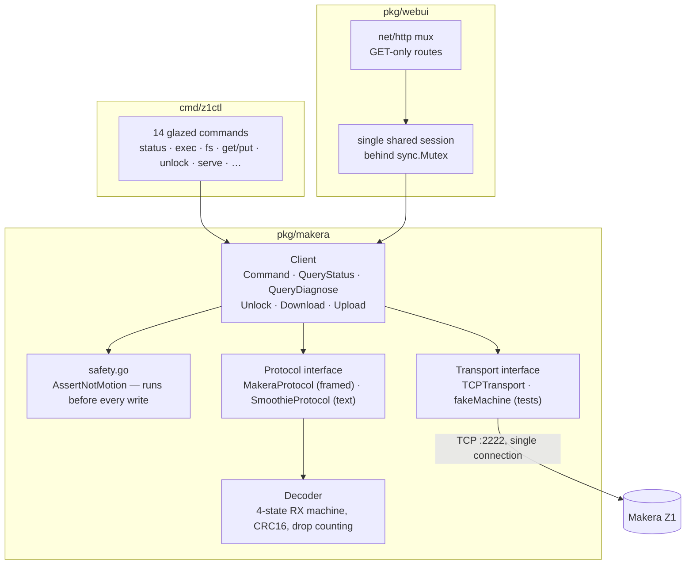

# Implementation Review: the Client, the CLI and the MZ1-003 Design

MZ1-003 · 2026-08-11 · reviews the work delivered under MZ1-001 and MZ1-002, and the MZ1-003 design guide itself

---

## 1. Purpose, and how to read this

This document is a pre-implementation review. Motion code is about to be built
on top of the client library, the CLI and the web server delivered in MZ1-001
and MZ1-002, following the design written for MZ1-003. Before writing that
code, the sensible thing is to read everything it will stand on and ask three
questions:

1. **Is the foundation sound?** Which properties of the existing code can motion
   safely rely on, and which are accidents of the read-only workload that will
   break once writes and long-lived motion state arrive?
2. **What would I change?** Defects, gaps and questionable choices in the
   existing code, each with a concrete failure scenario and a severity.
3. **Is the design right?** The MZ1-003 guide is thorough, but three of its
   choices deserve amendment before they are cast into code.

The verdict up front: **the foundation is good, and the design is largely
right.** The codebase is small (~4,000 lines of Go), consistently documented,
and its safety posture — refuse before a byte reaches the socket — is the
correct starting point for motion. The issues found are real but bounded: one
concurrency gap that becomes load-bearing the moment jogging exists (§6.1), a
handful of smaller defects (§6), and three design amendments (§7) that make the
authorised path structurally stronger than the design as written.

Sections 2–5 are the survey: what exists, how it is shaped, and what is good
about it. Section 6 is the defect list. Section 7 reviews the design itself and
records the amendments. Section 8 is the adjusted API that implementation will
follow. If you have read the MZ1-003 design guide and want only the delta, read
§6 and §7.

---

## 2. What was reviewed

| Area | Files | Lines | Delivered by |
|---|---|---|---|
| Protocol codec | `pkg/makera/frame.go`, `protocol.go`, `escape.go`, `detect.go` | ~610 | MZ1-001 |
| Session and client | `pkg/makera/client.go`, `transport.go`, `discovery.go` | ~660 | MZ1-001 |
| Reports and parsing | `pkg/makera/report.go`, `parse.go`, `halt.go` | ~660 | MZ1-001 |
| Safety guard | `pkg/makera/safety.go` + test | ~250 | MZ1-001 |
| File transfer | `pkg/makera/filexfer.go`, `filesystem.go` | ~550 | MZ1-001 |
| Test double | `pkg/makera/fakemachine_test.go` | ~410 | MZ1-001 |
| CLI | `cmd/z1ctl/` (14 commands) | ~2,240 | MZ1-001 |
| Web UI | `pkg/webui/` + static assets | ~900 | MZ1-002 |
| Design under review | `MZ1-003/design/01-…` | ~1,000 lines of prose | MZ1-003 |

All of it was validated against real hardware (`Makera_Z1_012146`, firmware
`1.0.15.0.1.11`) except where the docs explicitly say otherwise. The hardware
ground truth lives in `MZ1-001/reference/03-live-z1-observations-firmware-1-0-15.md`,
which by convention outranks the source-derived protocol spec. That convention —
"observation beats citation" — is itself one of the best decisions in the
project, and this review applies it to the code as well.

---

## 3. The architecture as built



Four load-bearing decisions shape everything:

- **One reader goroutine, ownership by flag.** The machine accepts one TCP
  connection, and both the control path and file transfers read it. Instead of
  pausing threads (which upstream does, with a busy-wait), `client.go:169-228`
  gives the connection exactly one reader and switches ownership with an atomic
  `Mode` flag. There is never a second consumer to race.
- **Refusal before the socket.** `Client.Command` calls `AssertNotMotion`
  (`client.go:263-268`) before encoding anything. The guard is a mechanism, not
  a convention: no motion verb can transit the generic path.
- **Generic decode, then interpretation.** `ParseReport` (`report.go:40-76`)
  decodes any `KEY:v,v|…` report into a map; `InterpretStatus` and
  `InterpretDiagnose` read named fields out of it. Unknown keys arrive as data
  rather than parse failures — which mattered immediately, because real
  firmware emits `E:` and `OTA:` keys no published client knows about.
- **The machine drives file transfer.** The host answers block requests
  (including out-of-order ones, hence seeking) rather than streaming. The fake
  machine exercises exactly the behaviours only a machine can initiate.

---

## 4. What is good, with evidence

This section is not a courtesy. Knowing which properties are deliberate — and
therefore safe to build on — is as important as knowing the defects.

### 4.1 The safety guard is in the right place, and over-inclusive by policy

`safety.go:70-118` classifies by first word, with an explicitly stated bias:
*"A false positive costs a caller one explicit authorisation; a false negative
costs a broken tool."* The one bug this bias produced on hardware (`time`
refused, breaking `z1ctl info`) was fixed with a scoped `writeWithArgs` set
rather than by loosening the default — the bare form queries, the argument form
mutates, and `switch` was deliberately kept always-refused because one argument
separates query from actuation. That is the right repair: the exception is
narrower than the rule.

The guard also distinguishes realtime bytes: `AssertRealtimeAllowed`
(`safety.go:130-135`) permits only `?` and the jog keepalive `0x1A` on
unauthorised paths. Feed hold `!` is currently refused there — correct for a
read-only tool, and §7.2 explains why it must flip to always-allowed now.

### 4.2 `Unlock` is a working template for authorised paths

`Client.Unlock` (`safety.go:154-157`) plus its CLI wrapper (`unlock.go`) embody
five properties the motion path must generalise:

- the name carries the authorisation — no generic path reaches it;
- preflight lives at the call site, where operator intent is known, and checks
  state → e-stop → cover → halt-reason band, refusing with a specific reason at
  each step;
- the *reason the machine stopped* is consulted before re-enabling it —
  `unlock.go:124-133` refuses to unlock a halt whose recovery band demands a
  reset or power cycle;
- it never retries, and says why in the comment;
- verification re-reads and never re-sends (`unlock.go:139-161`), the settled
  answer to the observability-lag pattern that bit three separate times.

### 4.3 The `known` contract exists and is already honoured

`Diagnose.CoverClosed() (closed, known bool)` (`report.go:272-277`) refuses to
guess when the endstop vector is short, and both existing consumers — the
unlock preflight and the web doctor panel — treat unknown as not-closed. The
comment on the endstop constants (`report.go:212-243`) is a model of honest
documentation: it states which indices were confirmed by triggering the input
(`E[5]` cover, three transitions) and which are inherited from published
clients and unverified (`E[0..4]`, because verifying them requires motion).

### 4.4 The web server's concurrency story is simple and correct — for reads

One session behind one mutex (`webui.go:110-122`), drop-on-error so the next
request reconnects, a 15-second listing cache so status polling stays fast.
Every route is a `GET`; the page says so; the CLI help says so. For a read-only
surface this is exactly enough. §6.5 covers why the drop-on-error policy needs
care once jog state exists.

### 4.5 The fake machine tests what hardware cannot

`fakemachine_test.go` implements the machine side of the transfer with
behaviour switches (`cancelOnMD5`, `scrambleBlock`, `requestOutOfOrder`,
`retryOnce`). The scramble test is the important one: it proves a block arriving
under the wrong sequence number is re-requested rather than written. The design
guide's observation that *the dead-man behaviour is testable in the fake and
nowhere else* extends this: a real machine cannot demonstrate that it stops
when keepalives cease without actually moving.

### 4.6 The documentation discipline is unusual and worth preserving

Comments state *why*, cite hardware observations with dates and firmware
versions, and mark unverified claims as unverified. The reviewer's job here was
dramatically easier because the code says which of its beliefs are measurements
and which are inheritances. Whatever else changes in this ticket, keep this.

---

## 5. The parts that are merely adequate

Two areas are fine for what they do today but should not be mistaken for more.

### 5.1 Protocol detection and the desync limitation

The decoder cannot recover from a false header inside junk bytes (documented on
`Decoder` in `frame.go`): there is no byte-stuffing in the wire format, so a
`86 68` inside garbage locks the state machine onto a phantom frame until its
length runs out. In practice drops have been zero across every hardware
session, and `Client.Drops()` is surfaced in the UI and doctor. This is
acceptable *because it is visible*. Motion raises the stakes slightly — a
desync during a jog means lost status replies — but the dead-man makes the
failure safe: no keepalives parse, no motion continues. No change needed;
worth knowing.

### 5.2 The single-predicate guard has reached the end of its life

`IsMotionCommand` answers one question, and MZ1-003 §3 already explains why
that is no longer enough: it cannot express that `M821` (light) and
`M3 S10000` (spindle) deserve different treatment, or that `suspend` must
*never* be refused. The small oddities in the current implementation — the
`readOnlyExceptions` set (`md5sum`, `mem`, `model`) is mostly redundant because
the prefix rule already requires a digit after a bare letter — are not worth
fixing in place; the classification table replaces the whole mechanism. The
existing tests, though, transfer: they pin the query/mutation boundary for
`time`, `wlan` and `switch`, and the new classifier must keep them green.

---

## 6. Defects and gaps found in review

Ordered by how much they matter to this ticket. Each has a failure scenario;
"severity" is about consequences for motion work, not for today's read-only
tool.

### 6.1 The Client does not serialise concurrent commands — HIGH, must fix in Phase 1

`Client.Command` is drain → write → collect-until-sentinel
(`client.go:263-311`), and `QueryStatus` is drain → write `?` → await bracketed
reply. Nothing stops two goroutines running these concurrently, and the failure
is not hypothetical once motion exists:

```
goroutine A: c.Command("version")     — drains, writes, waits for \x04
goroutine B: c.QueryStatus()          — DRAINS (eats A's partial output),
                                        writes '?', steals from the same msgs channel
```

Both consumers pull from the one `msgs` channel; whichever wakes first gets the
other's reply. Today this never happens — the CLI is sequential and the web
server wraps every request in its own mutex. But ADR-011 puts a **server-owned
jog keepalive on the status poll** while the browser also polls status and may
POST a jog-stop: three actors on one client. The web server's mutex could be
stretched to cover this, but the invariant belongs in the library, not in every
caller.

**Fix:** a command mutex inside `Client` serialising the
drain→write→collect critical section (`Command`, `QueryStatus`,
`QueryDiagnose`, and the transfer entry points). Realtime bytes must *not*
take it — feed hold and jog-stop must never wait behind a slow `ls`.

### 6.2 A slow consumer can drop a command's sentinel — MEDIUM

The read loop never blocks: when `msgs` is full it discards the oldest message
(`client.go:214-224`). The policy is right for status but wrong for the
sentinel: if 256 messages back up while a command is in flight, the `\x04`
echo can be discarded, and the command then times out after 15 s even though it
completed. Unlikely at today's traffic; more likely during job monitoring,
which generates continuous status traffic. The command mutex from §6.1 mostly
prevents the mixed workload, and the fix is cheap insurance on top: never
discard a message containing the sentinel byte.

### 6.3 `awaitBracketed` matches on the wrong evidence — LOW

`client.go:383-398` returns the first message containing a `<` byte. A
`NORMAL_INFO` line that happens to contain `<` — an error message quoting an
expression, a filename — would be misparsed as a status report and fail in
`ParseReport`, aborting a status query that would have succeeded a message
later. The fix is to keep scanning until `ParseReport` succeeds rather than
failing on the first candidate. Low severity, but the status path becomes the
jog keepalive path, where a spurious failure aborts a jog.

### 6.4 `Identify` swallows every error — LOW

`client.go:405-444` runs four commands and ignores each failure
(`if lines, err := …; err == nil`). On a healthy machine this is fine; on a
machine in Alarm, some commands still answer and some may not, and the caller
gets a partially populated `MachineInfo` with no indication anything failed.
`z1ctl info` then prints zeros that look like data. Return the info *and* an
aggregated error so callers can distinguish "cleanly identified" from "best
effort".

### 6.5 The web server's drop-on-error policy will need a jog hook — design note

`withClient` (`webui.go:110-122`) closes and forgets the session on any error.
Correct today: the next request redials. But once the server holds jog state
(ADR-011), dropping the session while a jog is active must first attempt the
jog-stop handshake, and — because the connection may already be dead — must
also rely on the firmware's own dead-man timeout as the backstop. This is not a
defect in the current code; it is a place where the current policy's simplicity
will silently become wrong if nobody looks at it. Phase 4 must revisit this
function.

### 6.6 `Homed` inference trusts an exact sentinel — LOW, documented

`InterpretStatus` (`report.go:208`) infers unhomed from
`MPos == (-1,-1,-1)` exactly. A homed machine physically parked at exactly
X=-1, Y=-1, Z=-1 would read as unhomed — three coordinates coinciding at the
sentinel to the fourth decimal, vanishingly unlikely and fail-safe in
direction (we would refuse a work-coordinate move on a homed machine, not
permit one on an unhomed machine). Acceptable; record it and move on.

### 6.7 Smaller observations, for completeness

- `EncodeRealtime` correctly concatenates multiple realtime frames into one
  buffer, so the `?`+`0x1A` digram is one write end to end. Verified against the
  requirement in `protocol.go:43-47`. No change.
- `handleFiles` reads the cache under `RLock` and repopulates without
  rechecking; two concurrent misses both hit the machine. Harmless (the mutex
  in `withClient` serialises them) — not worth code.
- `unlock.go` reads diagnose, then sends `$X`: a cover opened in that ~100 ms
  window defeats the check. §11.4 of the design already names this freshness
  limit; the machine's own interlock (halt 11) is the backstop. No further
  change is proportionate.
- `go.mod`'s `replace` directive for glazed sits uncommitted in the work tree
  after the repo merge; commit it with the first Phase 1 change.

---

## 7. Review of the MZ1-003 design itself

The design guide is the strongest document in the project. Its risk model
(§3), the Class 0 rule, the dead-man analysis (§4.2), the `known` contract
(§11.2), and the preflight-freshness rule (§11.4) should be implemented exactly
as written. The hardware bring-up sequence (§14.4) — air first, dead-man
deliberately tested by killing the tab mid-jog — is the right amount of
paranoia.

Three choices deserve amendment. Each is recorded here as the decision the
implementation will follow; where this section conflicts with the design guide,
this section wins.

### 7.1 Amendment A — `MotionRequest` must be typed, not a string list

The design proposes:

```go
type MotionRequest struct {
    Commands []string   // "Each is a complete G-code or $ command."
    Reason   string
    Class    RiskClass
}
```

and claims *"it cannot be built from a bare string, so a generic command path
cannot produce motion by accident."* The claim is stronger than the type. Any
code — including a future HTTP handler written in a hurry — can write:

```go
c.Motion(ctx, makera.MotionRequest{Commands: []string{userInput}, …})
```

and the structural guarantee evaporates: this is `exec` with extra steps. The
guarantee the design *wants* is that the G-code text is produced by our code
from validated parameters, never passed through. The type system can enforce
that:

```go
// A MotionOp is one validated operation. The G-code is rendered internally;
// no constructor accepts command text.
type MotionOp interface{ render() []string; class() RiskClass }

func StepJog(axis Axis, distance, feed float64) (MotionOp, error)   // $J X10 F600
func RapidTo(cs CoordSystem, target Axes) (MotionOp, error)         // G53 G90 G0 …
func SafeZ() MotionOp                                               // G53 G90 G0 Z-3
func Home() MotionOp                                                // $H
func SpindleOn(rpm int) (MotionOp, error)                           // M3 S…
func PlayFile(path string) (MotionOp, error)                        // play …

type MotionRequest struct {
    Ops    []MotionOp
    Reason string       // required, logged
}
```

`render` and `class` are unexported: outside `pkg/makera` there is no way to
get arbitrary text into a `MotionRequest`. The constructors validate (axis in
range, distance non-zero and bounded, feed positive, rpm within spindle range)
and refuse at construction, before a connection is even involved. `--dry-run`
falls out naturally: render the ops, print the frames, stop.

The cost the design worried about — "more ceremony per command" — is real but
pays for itself the first time someone tries to add a motion feature the easy
way and finds the easy way doesn't exist.

### 7.2 Amendment B — the classifier owns the risk class, not the caller

In the design's struct, `Class` is a field the *caller* sets, and the class
"determines which preflight applies". That inverts the authority: the component
being guarded chooses its own guard. A caller that mislabels a spindle start as
Class 3 skips the cover check, and nothing detects the lie.

With typed ops (Amendment A) the inversion disappears naturally: each op knows
its own class, `Motion` takes the *maximum* class across the request's ops, and
the caller cannot lower it. The caller's only contribution is intent (`Reason`)
and, where the design demands it, an explicit confirmation flag whose absence
refuses Class 1 requests.

The same authority question decides a second detail: feed hold. The current
`AssertRealtimeAllowed` refuses `!` on unauthorised paths — right for a
read-only tool, wrong from Phase 1 onward. Class 0 must be encoded where the
refusal currently lives: `?`, `0x1A`, `!`, and `0x19` become always-allowed,
and `~` (cycle start, Class 2) and `0x18` (soft reset, Class 2) remain gated.
The rule "a stop that can be refused is not a stop" is implemented in
`safety.go`, not merely stated in a document.

### 7.3 Amendment C — the jog keepalive becomes an explicit lease

> **Revised after operator review.** The lease design below was overruled in
> favour of 1:1 forwarding, and the operator's argument is better than the
> original: a server that emits keepalives from its own timer has a mechanism
> that can keep motion alive without a human — a lease-expiry bug fails toward
> *continuing*. A server that only forwards keepalives the browser sends has
> no such mechanism — every bug fails toward *stopping*, which is the correct
> asymmetry for a dead-man. The browser cannot reach the machine directly (the
> server holds the single TCP connection), so forwarding still transits the
> server; but each protocol keepalive is now CAUSED by a browser keepalive,
> and the held button drives the chain end to end. Background-tab throttling
> stalls the POSTs and stops the axis: annoying, safe, honest. No server
> watchdog is needed for stopping — the firmware's own dead-man is the stop;
> the server keeps only enough state to refuse a second jog and to run the
> polite 0x19/^Y handshake. The original lease argument is preserved below as
> the record of the road not taken.

ADR-011 is right that the server must own the protocol keepalive and the
browser's liveness must ride its status poll. The design then says "if that
poll stops for more than ~500 ms, the server stops the jog". Implementation
needs one more notion to make that testable and race-free: a **lease**.

```
POST /api/jog/start       → server starts jog, returns {lease: "j7f3…", ttl_ms: 600}
GET  /api/status?lease=…  → renews the lease as a side effect
POST /api/jog/stop        → ends the lease, runs the 0x19/^Y handshake
lease expires             → server runs the stop handshake, logs the expiry
```

The lease makes three things explicit that "the poll stopped" leaves implicit:
*which* client's liveness keeps the jog alive (two tabs share the session; only
the tab that started the jog renews it), *when* exactly expiry occurs (a
deadline, testable with a fake clock), and *what* the server does on expiry
(the same stop handshake as a deliberate stop, so there is one stop path, not
two). One jog lease exists at a time; a second `jog/start` while one is active
is refused, which also implements the design's "no queued motion" rule
server-side.

Failure ordering matters and is worth stating: on *any* error while a jog is
active — keepalive write fails, status parse fails, lease expires, session
drops — the server's first action is to stop sending keepalives (that alone
stops the machine within ~sub-second, by the firmware's dead-man), and its
second is to attempt the polite `0x19` handshake if the connection still
lives. The dead-man is the backstop, not the mechanism.

### 7.4 Additions the design should have included

- **Host-header validation on the control server.** ADR-012's same-origin
  check (`Origin` / `Sec-Fetch-Site`) does not stop DNS rebinding, where an
  attacker's page re-resolves its own hostname to `127.0.0.1` and the browser
  sends requests with an attacker-controlled `Host` and no CORS involvement for
  simple requests. The fix is one clause: reject any request whose `Host` is
  not the configured listen address or a literal loopback name. Cheap, and it
  closes the one LAN-independent attack on a loopback-bound server.
- **A `busy` response shape.** One in-flight motion request at a time (design
  §12.5) means the server will refuse overlapping POSTs; the refusal needs a
  distinct status (`409`) and body so the UI can render "already moving" rather
  than a generic error.
- **Jogging while unhomed is permitted.** The preflight table (§11.1, row 7)
  gates homing-dependence on *work-coordinate* moves only. Worth making
  explicit for jog: `$J` is relative and is exactly how an operator repositions
  an unhomed machine; refusing it would make the tool useless before homing.
  The classifier must encode this per-op, not per-class.
- **`play` while playing (open question 7)** resolves without hardware: the
  preflight's "no job running" condition refuses it client-side regardless of
  what the firmware would do. The firmware's behaviour remains worth knowing,
  but nothing blocks on it.

### 7.5 What was checked and found right

For balance, claims in the design that this review verified against source or
prior observation rather than taking on faith:

- The keepalive digram must be one write — confirmed against
  `protocol.go:43-47` and upstream `Controller.py:1729-1742`.
- The `^Y` stop handshake and the immediate suppression of keepalives —
  confirmed against upstream `Controller.py:1848-1863`.
- Safe-Z of `-3` matches the machine's own pack-position file read off the SD
  card during MZ1-001.
- The halt recovery bands and the refusal to unlock a reset-band halt —
  already implemented and exercised (`halt.go`, `unlock.go:124-133`).
- Stock firmware sends no `G:` key, so the active WCS needs `get wcs` —
  matches `report.go:145-150` and the hardware observations document.

---

## 8. The adjusted API

What implementation will build, design amendments applied. This is a contract
sketch, not final code; names may shift, shapes should not.

### 8.1 `pkg/makera` — motion core

```go
// Risk classes, from MZ1-003 §3, Class 0 lowest.
type RiskClass int
const (
    ClassStop RiskClass = iota  // never gated
    ClassAccessory              // Class 3 in the design's numbering
    ClassStateEnabling          // Class 2
    ClassMotion                 // Class 1
)

// Classify replaces IsMotionCommand as the single authority on what a
// command string may do. IsMotionCommand remains as Classify(cmd) >= ClassStateEnabling
// so existing call sites and tests keep their meaning.
func Classify(cmd string) RiskClass

// Typed ops (§7.1). Constructors validate; render/class are unexported.
func StepJog(axis Axis, distanceMM, feed float64) (MotionOp, error)
func ContinuousJogStart(axis Axis, positive bool, feed float64) (MotionOp, error)
func RapidTo(cs CoordSystem, target PartialAxes) (MotionOp, error)
func SafeZ() MotionOp
func Park() MotionOp
func Home() MotionOp
func SpindleOn(rpm int) (MotionOp, error)
func SpindleOff() MotionOp
func Accessory(name string, on bool, value int) (MotionOp, error)
func ZeroWorkOffset(system string, axes []Axis) (MotionOp, error)
func PlayFile(path string) (MotionOp, error)

type MotionRequest struct {
    Ops    []MotionOp
    Reason string
}

// Preflight reads status and diagnose FRESH and evaluates the §11.1 table
// against the request's class. Returns every failure, not just the first.
func (c *Client) Preflight(ctx context.Context, class RiskClass) (PreflightReport, error)

// Motion: preflight → send each op → verify by re-reading. Never retries.
func (c *Client) Motion(ctx context.Context, req MotionRequest) (MotionResult, error)

// DryRun renders the request without a connection: commands, frames, class.
func DryRun(req MotionRequest) (DryRunReport, error)

// Continuous jog session (§7.3): keepalives ride QueryStatus while active;
// Stop runs 0x19 → suppress → await ^Y. Any error stops keepalives first.
func (c *Client) JogStart(ctx context.Context, op MotionOp) (*JogSession, error)
func (j *JogSession) Stop(ctx context.Context) error

// Job lifecycle.
func (c *Client) Play(ctx context.Context, path string) error       // Class 1
func (c *Client) Suspend(ctx context.Context) error                 // Class 0
func (c *Client) Resume(ctx context.Context) error                  // Class 2
func (c *Client) Abort(ctx context.Context) error                   // Class 0
func (c *Client) Progress(ctx context.Context) (Playback, bool, error)
```

Plus the §6.1 fix: an internal `cmdMu` serialising every
drain→write→collect exchange, which realtime writes bypass.

### 8.2 CLI surface

```
z1ctl jog  <axis> <±distance> [--feed N] [--confirm] [--dry-run]
z1ctl home                      --confirm  [--dry-run]
z1ctl goto [--x N] [--y N] [--z N] [--machine|--work] [--safe-z] --confirm [--dry-run]
z1ctl park                      --confirm  [--dry-run]
z1ctl spindle on --rpm N        --confirm  | z1ctl spindle off        (off = Class 0 in effect)
z1ctl accessory light|vacuum|air on|off
z1ctl job play <path> --confirm | suspend | resume --confirm | abort | progress
z1ctl job run <local-file> --confirm      upload → verify → preflight → play → monitor
z1ctl hold                                 feed hold, always available, no flags
```

Exit codes on `job run`: `0` complete, `1` usage/connection, `2` refused,
`3` ended in alarm — as designed.

### 8.3 HTTP surface

As the design's §13.2 table, with the §7.4 amendments: `Host` validation on
every request, token on mutating routes (always minted; enforced when
non-loopback), `409` for overlapping motion, lease fields on
`/api/jog/start` and `/api/status`.

---

## 9. Prioritised recommendations

What implementation does with all of the above, in order:

1. **Phase 1 blockers:** the command mutex (§6.1) and the sentinel-drop guard
   (§6.2) go in before any motion code, because the jog keepalive is what makes
   them load-bearing. The classifier (§8.1) replaces `IsMotionCommand`'s
   internals with the four-class table while keeping the existing tests green,
   and flips `!`/`0x19` to always-allowed (§7.2).
2. **Typed ops and preflight** (§7.1, §8.1) with table-driven tests, one per
   §11.1 condition, plus `TestPreflightRefusesUnknownCoverState`.
3. **Fake machine extensions:** scripted state sequences, jog keepalive
   interval tracking with dead-man assertion, `^Y` handshake, alarm injection.
4. **CLI commands** with `--dry-run` everywhere and `--confirm` on Class 1/2.
5. **Web UI and server** per §8.3, revisiting `withClient`'s drop policy
   (§6.5) when jog state arrives.
6. **Defer** exactly what the design defers (probing, ATC, resume-at-line), and
   additionally defer `Identify`'s error aggregation (§6.4) unless it falls out
   free — it is real but not on this ticket's path.

Hardware bring-up (§14.4 of the design) remains gated on an operator at the
machine, and nothing in this ticket's code will be exercised against real
hardware without that. The three Phase 0 questions — `play -O` vs `-v`,
single-axis homing, the work-zero mechanism — stay open; the code that depends
on their answers (`play` flags, `home --axis`, `wcs zero`) ships behind the
conservative choice in each case (no flag, all-axes only, `G10 L20` marked
unverified) so answering them later is a one-line change, not a redesign.

---

## 10. File reference

| File | Role in this review |
|---|---|
| `makera-z1-cli/pkg/makera/client.go` | §6.1–6.4: serialisation gap, sentinel drop, awaitBracketed, Identify |
| `makera-z1-cli/pkg/makera/safety.go` | §4.1, §5.2, §7.2: the guard being replaced, and where Class 0 lands |
| `makera-z1-cli/pkg/makera/report.go` | §4.3, §6.6: the known contract, endstop honesty, Homed sentinel |
| `makera-z1-cli/pkg/makera/halt.go` | §7.5: recovery bands, verified |
| `makera-z1-cli/pkg/makera/protocol.go` | §7.5: one-write realtime digram |
| `makera-z1-cli/pkg/makera/frame.go` | §5.1: desync limitation |
| `makera-z1-cli/pkg/makera/fakemachine_test.go` | §4.5: the double to extend |
| `makera-z1-cli/pkg/webui/webui.go` | §4.4, §6.5: session policy and its jog interaction |
| `makera-z1-cli/cmd/z1ctl/cmds/unlock.go` | §4.2: the authorised-path template |
| `MZ1-003/design/01-…` | §7: the design under review; amendments A–C supersede it where they conflict |
