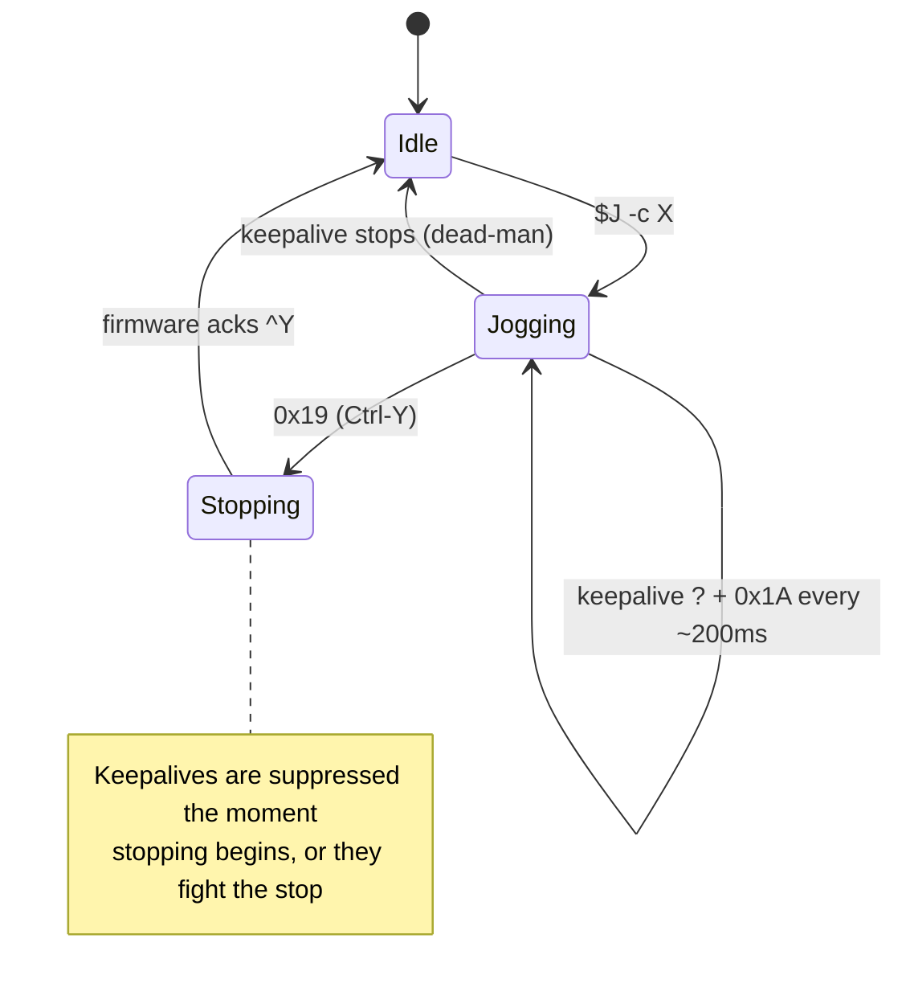
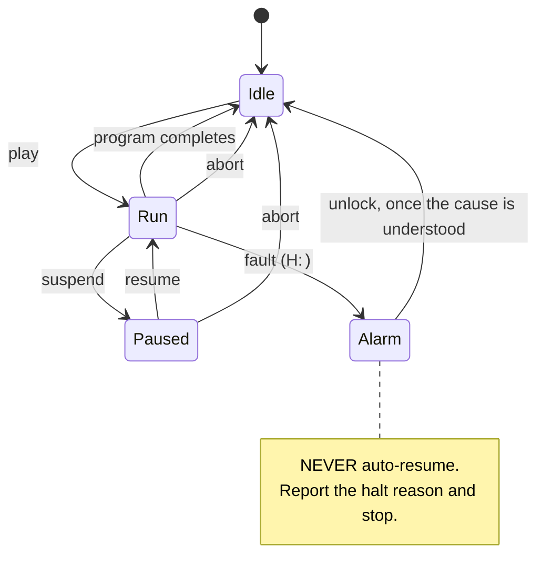

# Motion and Job Control, with a Manual Control UI

**Analysis, Design and Implementation Guide**

Ticket MZ1-003 · 2026-08-11 · builds on MZ1-001 (protocol and client) and MZ1-002 (control page)

---

## 0. How to read this document

This is written for an engineer who has read MZ1-001 or at least skimmed its
protocol reference, and who has never written software that moves a machine
tool. It goes in this order deliberately:

| Part | Sections | What you get |
|---|---|---|
| **I — What changes** | 1–3 | Why this ticket is different from every previous one, and the risk model that follows |
| **II — The mechanisms** | 4–9 | Jogging, positioning, job lifecycle, halt handling, each with its protocol detail |
| **III — The architecture** | 10–13 | The authorised path, the preflight, the API, the UI |
| **IV — Getting it right** | 14–18 | Testing, bring-up, decision records, phases, risks |

**If you read only one section, read §3 and §11.** Everything else is
engineering; those two are the reason this ticket needs a design document at
all.

Terminology, machine facts and the wire protocol are not repeated here. They are
in `MZ1-001/reference/02-makera-wire-protocol-reference.md` (the specification)
and `MZ1-001/reference/03-live-z1-observations-firmware-1-0-15.md` (hardware
ground truth, which outranks the specification wherever they disagree).

---

# Part I — What changes

## 1. Executive summary

### 1.1 What we are building

Two things, at the same time and for the same reason:

1. **Motion and job control in `z1ctl`** — jogging, positioning, homing, spindle
   and tool commands, and the `play` / `suspend` / `resume` / `abort` job
   lifecycle, all behind an authorisation architecture that makes accidental
   motion structurally difficult rather than merely discouraged.
2. **A manual control UI** — a pendant-style panel in the existing control page,
   so an operator can jog, home, set work offsets and run a job by hand instead
   of composing CLI invocations.

The UI is not a nicety bolted on afterwards. Testing motion through a CLI means
typing a command, reading a table, and typing the next one, while standing next
to a machine that is moving. That is a bad loop for exactly the work where the
feedback needs to be immediate and the stop needs to be one gesture away. **The
UI is the safer test harness**, which is why it is in scope from the start.

### 1.2 What makes this ticket different

Everything built so far shares one property: **the worst possible bug was a
wrong answer.** A misparsed status report shows a wrong number. A failed
download writes a bad file. A wrongly refused command is an annoyance.

From this ticket onward the worst possible bug is a machine moving when nobody
asked it to, or not stopping when somebody did. The engineering does not change
much. The standard of evidence does.

Two consequences run through the whole design:

- **Software is not the safety system.** The physical emergency stop and the
  cover interlock are the safety devices. Software adds gating that is
  convenient and catches mistakes, and it must never be the only thing between
  an operator and an injury. Design as though every software check will
  eventually fail, because eventually one will.
- **Refusing is always available and always cheap.** When the software cannot
  establish that an action is safe, it refuses. A refused jog costs a second.

### 1.3 Current position

MZ1-001 delivered the protocol, the client library and the read-only CLI, all
validated against `Makera_Z1_012146` on firmware `1.0.15.0.1.11` with zero
frame-decoder failures. MZ1-002 delivered the control page. The file transfer
works in both directions and has been exercised on hardware.

`pkg/makera/safety.go` currently **refuses every motion verb** before a byte
reaches the socket. One authorised path exists — `Client.Unlock` — and it is the
template this ticket generalises.

---

## 2. Scope

### 2.1 In scope

- Jogging: step and continuous, with the keepalive handshake (§4).
- Positioning: absolute and relative moves, safe-Z and park idioms (§5).
- Homing (§6).
- Work coordinate systems: reading, setting, zeroing (§7).
- Spindle, accessories and tool commands (§8).
- Job lifecycle: play, suspend, resume, abort, progress, halt handling (§9).
- The authorisation architecture and the preflight (§10–11).
- The manual control UI and its HTTP surface (§12–13).

### 2.2 Explicitly out of scope

- **Probing and auto-levelling** (`M495`, `M495.3`, `M469.x`). These move an axis
  toward a fragile object until it makes contact, and a wrong parameter breaks
  a probe or a spindle nose. They deserve their own ticket after this one is
  proven.
- **Automatic tool change** (`M6`). It is a motion sequence with a mechanical
  gripper, and getting it wrong drops a tool.
- **Resume-at-line.** The reference controller reconstructs modal state — tool,
  feed, spindle, coordinate system, distance mode — and injects a recovery
  preamble before resuming mid-file. It is genuinely useful and genuinely
  intricate; the community controller has fixed at least six bugs in it. Not
  now.
- **Firmware update.** Separate ticket, separate risk.

### 2.3 Prerequisites

One item is **blocking** and must be settled before any code is written:

> **A safety review of §3 and §11 by someone who operates the machine.** The
> list of gated commands and the preflight conditions are engineering
> judgements about a physical machine, and they should be checked by someone
> whose hands are near it.

---

## 3. The risk model

MZ1-001 began with one question — *can this command move the machine?* — and
that turned out to be too coarse. Running it against hardware produced a bug:
`z1ctl info` reported a clock of zero because the guard refused `time`, the
command that *reads* the clock. The verb alone does not determine risk; the
arguments do, and so does what the command enables rather than does.

Four classes have emerged. Each warrants different treatment, and collapsing any
two produces either a dangerous tool or an unusable one.

### Class 1 — Motion

`$H` · `$J` · `G0` `G1` `G2` `G3` · `G28` `G30` · `G53 G0 …` · `M496.x` · `M3` · `M6`

**Risk:** injury, broken tooling, ruined work.
**Treatment:** authorised path, explicit per-call intent, full preflight, never
retried, never a side effect.

### Class 2 — State-enabling

`$X` (unlock) · `resume` · soft reset `0x18`

**Risk:** commands no movement itself, but permits or resumes it.

This class is easy to get wrong in both directions. Refusing `$X` outright makes
the tool unable to recover from an alarm. Treating it as ordinary means a
scripted retry loop can silently re-arm a machine that halted for a reason.

**Treatment:** distinctly named entry point, `--confirm`, preflight that
establishes *why* the machine stopped before permitting it to continue. Already
implemented for `Unlock`; §10.2 generalises it.

### Class 3 — Accessory

`M801/M802` vacuum · `M811/M812` spindle fan · `M821/M822` light ·
`M831/M832` tool sensor power · `M841/M842` probe charger · `M851/M852` external
PWM · `M7/M9` air · `M220/M223` overrides

**Risk:** switches a real output. Nothing moves, but a vacuum starts, or a feed
override changes the speed of a *running* job.

This class is why "M-codes are motion" is not a usable rule: `M821` turns on a
light and `M3 S10000` starts a spindle at ten thousand RPM, and both are
M-codes.

**Treatment:** allowed without confirmation, because the light and the vacuum
are things an operator toggles constantly. **Except** the overrides `M220` and
`M223`, which change the behaviour of a job already in motion and belong in
Class 1 whenever a job is running.

### Class 4 — Data

`rm` · `mv` · `put` · `mkdir` · `config-set`

**Risk:** data loss, no injury.
**Treatment:** no confirmation gate — typing `rm` is the intent — but each
verifies its own effect. Implemented in MZ1-001.

### 3.1 The classification table

This is the artefact to review. It replaces the single `motionVerbs` set in
`safety.go`.

| Command | Class | Notes |
|---|---|---|
| `$H` | 1 | Moves **all** axes at speed. The single most dangerous command here |
| `$J <axis><d>` | 1 | Step jog |
| `$J -c <axis>` | 1 | Continuous jog; requires keepalive (§4.2) |
| `$X` | 2 | Clears alarm, re-enables motion |
| `G0/G1/G2/G3` | 1 | |
| `G53 G0 …` | 1 | Machine coordinates; ignores work offset |
| `G28/G30` | 1 | Move to stored position |
| `G10 L2/L20` | 1* | Sets a work offset. No motion, but changes where every subsequent move goes — treat as Class 1 |
| `M3 S<rpm>` / `M5` | 1 | Spindle |
| `M6 T<n>` | 1 | Out of scope this ticket |
| `M496.1`–`.5` | 1 | Goto clearance / origin / anchors |
| `M495*`, `M469*`, `M494` | 1 | Probing. Out of scope this ticket |
| `M220`/`M223` | 3 → 1 | Overrides; Class 1 while a job runs |
| `M801`…`M852`, `M7`/`M9` | 3 | Accessories |
| `play` | 1 | Starts a program. Effectively unbounded motion |
| `suspend` / `abort` | 0 | **Stopping is always allowed.** See below |
| `resume` | 2 | Restarts motion that was deliberately stopped |
| `!` (feed hold) | 0 | Always allowed |
| `~` (cycle start) | 2 | Resumes from feed hold |
| `0x18` soft reset | 2 | |
| `0x19` jog stop | 0 | Always allowed |

**Class 0 — commands that only stop things — are never gated.** `suspend`,
`abort`, feed hold and jog-stop must work when the machine is in any state,
when the preflight is failing, when the cover is open, and when the software is
confused about what is happening. A stop that can be refused is not a stop.

---

# Part II — The mechanisms

## 4. Jogging

Jogging is manual, incremental movement under operator control. It is the first
motion to implement because it is bounded, it is what an operator does most, and
its continuous form has a property that makes it unusually safe to build on.

### 4.1 Step jog

```
$J X10          move 10 mm in +X at maximum speed
$J X-1 F0.25    move 1 mm in -X at 25% of the axis maximum
```

Each command is one bounded move. It completes or it does not. There is no
ongoing state to manage, which makes step jog the right first target.

The direction argument is an axis letter and a signed distance.

> **Corrected during bring-up (2026-08-11).** This section originally showed
> `F600`, mm/min-style, copied from the reference controller. On STOCK
> firmware `F` is a *scale of max_rate* — `F0.5` is half speed, and anything
> ≥ 1 means maximum, which is why F1/F10/F300/F1000 all moved identically on
> the real machine. The community firmware later redefined `F` as mm/min and
> moved the scale to `S`. z1ctl exposes both units and detects the dialect:
> `--speed-scale 0-1` works everywhere (`F` on stock, `S` on community);
> `--feed mm/min` works on community and is refused on stock, which cannot
> express it. Full evidence: MZ1-001 `reference/03` §11.

### 4.2 Continuous jog, and the dead-man property

Continuous jog moves while the operator holds a control and stops when they let
go. The protocol implements this with a keepalive, and **the keepalive is a
dead-man switch built into the firmware.**

```
start:      $J -c X            (optionally  $J -c X F<speed>)
keepalive:  '?' + 0x1A         every status poll, ~200 ms, ONE write
stop:       0x19               realtime; wait for the firmware's ^Y ack
```

Three details, each of which matters:

**The keepalive rides on the status poll.** Upstream sends `?` and `0x1A`
together whenever continuous jog is active
(`CC/Controller.py:1729-1742`). The comment explains why they must be a single
write: sending them separately races other traffic and leaves orphaned `1` bytes
in the firmware's command buffer, observed as `111…$J …`.

**If the host stops sending, the machine stops moving.** That is the dead-man
property, and it is the strongest safety guarantee available in this entire
system, because it does not depend on our software behaving correctly — it
depends on our software *stopping*. A crashed client, a severed network, a
killed process: all of them stop the axis.

**Stopping is a handshake, not a fire-and-forget.** Upstream sends `0x19`
(Ctrl-Y), sets a `stopping` flag *immediately* so that subsequent status polls
stop sending keepalives that would fight the stop, and waits for the firmware to
acknowledge with `^Y` before allowing a new `$J -c`
(`CC/Controller.py:1848-1863`).



**Design consequence for the UI (§12):** a press-and-hold button maps directly
onto this. Hold → start plus keepalives. Release, blur, page-hide, disconnect,
or crash → keepalives stop → machine stops. The UI does not need to invent a
dead-man; it needs to avoid defeating the one that exists.

**Do not** implement continuous jog by sending repeated step jogs. That has no
dead-man property and queues motion the operator can no longer cancel.

---

## 5. Positioning, and the ordering rule that is not style

### 5.1 Safe-Z first

```
G53 G0 Z-3                  retract Z in MACHINE coordinates
G53 G0 X-197 Y-206          then move XY
```

**Z retracts before any XY move.** This is not a preference. A tool at cutting
depth moved in XY ploughs through the workpiece, the fixture, or the table.

The reference controller uses `-2` rather than `0` for its safe-Z because X-sag
compensation on some models is close to a millimetre
(`CC/Controller.py:1889-1896`). The Z1's own pack-position file, read off the
machine during MZ1-001, uses `-3`:

```gcode
G90 G0 G53 Z-3
G90 G0 G53 X-197 Y-206
G90 G0 G53 Z-13
```

That file is worth studying: it is Makera's own idiom for the machine, it moves
Z clear first, and it uses `G53` throughout so it does not depend on a work
offset being set correctly.

### 5.2 `G53` and why it matters here

`G53` means "this move is in machine coordinates, ignore the work offset". For
any move whose purpose is *mechanical* — park, safe-Z, go to an anchor — `G53`
is correct, because the move should not change meaning when the operator sets a
new work zero.

For any move whose purpose is *about the part*, work coordinates are correct.

A positioning helper that mixes these silently will eventually move somewhere
surprising. Make the coordinate system an explicit parameter, not a default.

### 5.3 Distance mode

`G90` absolute, `G91` relative. The machine has a modal state, so a helper that
assumes one without setting it will do the wrong thing after any other command
changes it. Always emit the mode word with the move:

```
G90 G0 X10 Y10      unambiguous
G0 X10 Y10          depends on whatever ran last
```

`get state` reports the current modal set (§7.2), so the client can also detect
and warn.

---

## 6. Homing

`$H` homes all axes. It is the most dangerous single command in this ticket
because it moves every axis at speed, and it is the one an operator needs most
often, because nothing else works properly until the machine has a reference.

Observed on hardware: an unhomed Z1 reports `MPos: -1,-1,-1`, and `z1ctl`
already surfaces that as `homed: false` rather than showing a coordinate that
looks real.

**Requirements:**

- Never a side effect. Never part of a composite command. Never a retry.
- Preflight: cover closed, emergency stop clear, no job running, no alarm.
- Requires explicit confirmation distinct from other motion — a `--confirm`
  flag in the CLI, a two-step gesture in the UI (§12.4).
- Report progress. Homing takes tens of seconds and the machine reports `Home`
  as its state; a UI that appears frozen invites the operator to start pressing
  things.

**Open question:** whether the Z1 supports single-axis homing (`$H X`). Not
observed. Determine it by reading firmware config rather than by guessing at the
machine.

---

## 7. Work coordinate systems

### 7.1 Reading

Stock Z1 firmware does **not** report the active coordinate system in its status
report — there is no `G:` key (MZ1-001 `reference/03` §3). The active WCS must be
read with `get wcs`, which `z1ctl status --wcs` already does:

```
[current WCS: G54]
[G54:-190.5200,-193.7300,-78.2153,90.0000,0.0000]
[G55:0.0000,0.0000,0.0000,0.0000,0.0000]
...
[G28:0.0000,0.0000,0.0000]
[Tool Offset:0.0000,0.0000,0.0544]
[PRB:0.0000,0.0000,0.0000:0]
```

Five components on stock firmware (X, Y, Z, A, B); community firmware appends a
sixth for rotation. `pkg/makera/parse.go:ParseWCS` handles both.

### 7.2 Modal state

```
get state  →  [G0 G54 G17 G21 G90 G94 M0 M5 M9 T0 F2000.0000 S1.0000]
```

Motion mode, coordinate system, plane, units (`G21` = mm), distance mode
(`G90` = absolute), feed mode, program state, spindle, coolant, tool, feed and
speed. `ParseModalState` returns these as words.

Note that the modal tool word (`T0`) and the physically loaded tool reported in
the status report (`T:2`) are tracked separately by the firmware. Do not conflate
them.

### 7.3 Setting a work zero

Setting a work offset does not move anything, but it changes where every
subsequent work-coordinate move goes — which makes it Class 1 in effect. Two
mechanisms:

- `G10 L20 P1 X0 Y0 Z0` — set the offset for coordinate system 1 (G54) such that
  the current position becomes the given value. This is "zero here".
- `G10 L2 P1 X… Y… Z…` — set the offset directly.

**Unverified on this machine.** Both are standard, neither has been tested here.
Confirm before exposing. The reference controller writes offsets through its own
configuration path, which may be the more reliable route on this firmware —
check `config-get`/`config-set` for `coordinate.anchor*` keys.

A UI that offers "zero X/Y/Z here" must show what it is about to change and
require confirmation, because an accidental re-zero silently invalidates a
program that was correct.

---

## 8. Spindle, accessories and overrides

```
M3 S12000     spindle on at 12000 rpm
M5            spindle off
M7 / M9       air on / off
M821 / M822   light on / off
M801 S<n> / M802   vacuum on at power / off
M811 S<n> / M812   spindle fan
M851 S<n> / M852   external PWM
M220 S<n>     feed override %
M223 S<n>     spindle override %
```

The spindle is Class 1: `M3` starts a cutter spinning, and it does so whether or
not the cover is closed. Everything else in the accessory list is Class 3 and can
be exposed as ordinary toggles — the machine's own light and vacuum are things
an operator flips constantly.

The overrides are the exception noted in §3: `M220`/`M223` change the speed of a
job that is already running, which is a real intervention on a moving machine.
Gate them as Class 1 whenever `P:` indicates playback.

The status report carries spindle state as `S:cur,target,override[,…]`, and the
diagnose report carries the accessory switches. `z1ctl status --diagnose`
already surfaces both.

---

## 9. Job control

### 9.1 The lifecycle

The Z1 does not stream G-code. A file is uploaded to the SD card and executed
locally by `play`. The host supervises.



```
play /sd/gcodes/part.nc [-O|-v]
suspend
resume
abort
progress
```

**The `play` flag is unresolved.** The reference controller sends `-O` for
O-code support (`CC/Controller.py:707-712`); the firmware's own `help` documents
`-v`. Neither has been tested here. Determine it on a scratch air-cut file
before it matters.

### 9.2 Monitoring

Two independent sources:

- The status report's `P:` key — `lines, percent, seconds[, playing]`. Absent
  entirely when no job is running, which is how `z1ctl` already decides whether
  `Playing` is nil.
- The `progress` command, which answers `Not currently playing` or a progress
  line. Simpler, and does not require the optional-key handling.

Use `P:` for the UI's continuous display since it rides on the status poll that
is already happening, and `progress` for a one-shot CLI query.

### 9.3 Halt handling

A job that faults leaves the machine in `Alarm` with a halt reason in `H:`.
MZ1-001 ported the reason table and its three recovery bands:

| Range | Recovery | Examples |
|---|---|---|
| < 20 | unlock clears it | manual halt, probe fail, soft limit, **cover opened while playing (11)**, e-stop (13) |
| 21–40 | **reset required** | hard limit, axis motor error, spindle stall, SD read failure |
| > 40 | **power cycle required** | spindle alarm |

`makera.HaltReason(code)` returns the text and the band, and routes unknown codes
by numeric range so a future firmware code still gets the right recovery.

**The rule: never auto-resume, never auto-retry.** Report the reason, name the
required recovery, and stop. A machine that halted has a physical cause, and
clearing the alarm without understanding it — a limit trip while the axis is
still against the limit, a probe fault without inspecting the probe — either
fails immediately or breaks something.

### 9.4 `job run` as a composite

The ergonomic command most people will use:

```
upload → verify digest → preflight → play → monitor to completion
```

Each step already exists. The composite must fail closed: if the digest does not
verify, do not play. If the preflight fails, do not play. If the machine alarms
mid-job, stop reporting success and surface the halt reason.

Exit codes: `0` complete · `1` usage/connection · `2` refused · `3` ended in
alarm. Scripts depend on these.

---

# Part III — The architecture

## 10. The authorised path

### 10.1 The existing template

`Client.Unlock` is the pattern to generalise:

```go
// Unlock clears a latched alarm by sending the GRBL unlock command.
//
// Why this is safe to authorise while motion is not: `$X` clears the alarm lock
// and nothing else. It commands no movement.
//
// What it DOES do is re-enable motion, so callers must preflight first. This
// function does not preflight for you — that belongs at the call site, where
// the operator's intent is known.
//
// It never retries. If the alarm does not clear, that is information, and
// sending the command twice hides it.
func (c *Client) Unlock(ctx context.Context) ([]Message, error) {
    c.logger.Warn().Msg("sending $X to clear a latched alarm — this re-enables motion")
    return c.commandUnchecked(ctx, "$X")
}
```

Three properties worth preserving:

1. **The name carries the authorisation.** A reader of any call site sees that
   something unusual is happening.
2. **It does not preflight.** Preflight belongs where intent is known, so the
   library cannot smuggle in an assumption about why the caller wants this.
3. **It never retries**, and says so.

### 10.2 The proposed shape

```go
// MotionRequest is one operator-authorised movement.
//
// Constructing one is the authorisation. It cannot be built from a bare string,
// so a generic command path cannot produce motion by accident.
type MotionRequest struct {
    // Commands are sent in order. Each is a complete G-code or $ command.
    Commands []string
    // Reason is recorded in the log and in any audit trail. Required.
    Reason string
    // Class is the risk class; determines which preflight applies.
    Class RiskClass
}

// Motion executes an authorised movement.
//
// Never retries: re-sending a G0 after a timeout can execute the move twice.
// Never called from a retry path, a reconnect path, or a status query.
func (c *Client) Motion(ctx context.Context, req MotionRequest) (MotionResult, error)
```

The key structural property: **`MotionRequest` cannot be constructed from user
input alone.** A CLI command builds one from parsed, validated flags. The HTTP
handler builds one from a typed request body. Nothing accepts a free-text
command string and turns it into motion — that is what `z1ctl exec` is for, and
`exec` refuses motion.

### 10.3 What must never happen

Enumerated so a reviewer can check for each:

- Motion issued from a retry loop.
- Motion issued on reconnect (restoring "what we were doing").
- Motion as a side effect of a status query, a listing, or a transfer.
- A motion command re-sent after a timeout.
- An alarm cleared automatically so that a queued motion can proceed.
- A composite that continues after one of its steps failed.

---

## 11. The preflight

**This section and §3 are what the safety review is for.**

### 11.1 Conditions

| # | Condition | How | Failure means |
|---|---|---|---|
| 1 | Connected, protocol known | session established | refuse |
| 2 | Not in `Alarm` | status `State` | refuse; report halt reason and required recovery |
| 3 | Emergency stop clear | diagnose `I[0]` | refuse |
| 4 | Cover closed | diagnose `E[5]`, **confirmed on hardware** | refuse |
| 5 | Cover state *knowable* | `CoverClosed()` second return | refuse — unknown is not closed |
| 6 | No job running | status `P:` / state `Run` | refuse unless the command is Class 0 |
| 7 | Homed, for work-coordinate moves | `MPos != -1,-1,-1` | refuse; machine coordinates are meaningless unhomed |
| 8 | No limit triggered | diagnose `E[0..4]` | **warn only** — indices unverified (§11.3) |

### 11.2 The `known` contract

```go
// CoverClosed reports the cover interlock.
//
// The second return value is false when the machine did not send enough
// endstop fields to locate the bit. Callers gating motion on this MUST treat
// unknown as "do not proceed" rather than as "closed" — a preflight that
// cannot verify the cover has not verified the cover.
func (d Diagnose) CoverClosed() (closed, known bool)
```

Writing `closed, _ := d.CoverClosed()` in a preflight is a defect. Consider a
linter rule or a wrapper that cannot discard the second value.

### 11.3 What the preflight cannot establish

Stated plainly, because a preflight that overstates its coverage is worse than
one that admits gaps:

- **The axis limits `E[0..4]` are inherited, not verified.** MZ1-001's mapping
  session confirmed `E[5]` (cover), `P[1]` (tool setter) and `I[0]` (e-stop) by
  triggering them. Triggering an axis limit requires motion, so those five
  indices are still upstream's claim. Treat them as advisory until verified.
- **Nothing knows whether a workpiece is clamped**, whether the tool in the
  spindle is the one the program expects, or whether anyone is standing in the
  enclosure.
- **The cover interlock is a sensor, not a lock.** It reports; it does not
  prevent.

The preflight reduces the rate of stupid mistakes. It is not a safety system.

### 11.4 Freshness

Preflight state must be read **immediately** before acting, not taken from a
cached status poll. The gap between "cover was closed 800 ms ago" and "cover is
closed" is exactly the interval in which someone opens it.

Note the related hazard from MZ1-001: on this machine a command's *effect* and
its *observability* are separate events, hundreds of milliseconds apart. That
bug bit three times. For preflight the implication runs the other way — read
late, act immediately — but the same latency is involved.

---

## 12. The manual control UI

### 12.1 Why it is in this ticket

Testing motion through a CLI means composing a command, reading a table, and
composing the next one, while standing next to a moving machine. The UI is the
safer test harness: a stop is one gesture, state is continuously visible, and
the operator's hands are not on a keyboard composing syntax.

It extends the existing read-only page (MZ1-002), which already has the DRO,
polling, tabbed panels and the design tokens shared with DROPCUT Studio.

### 12.2 Layout

```
┌──────────────────────────────────────────────────────────────────────┐
│ DROPCUT CONTROL                          connected · Idle · homed ✓  │
├────────────────────────────────┬─────────────────────────────────────┤
│ DIGITAL READOUT                │  Files │ Checks │ Machine │ Raw     │
│   X   189.520      -1.000      │                                     │
│   Y   192.730      -1.000      │  ┌───────────────────────────────┐  │
│   Z    77.161      -1.000      │  │ JOB                           │  │
│   A   -90.000       0.000      │  │  part.nc      line 1234  42%  │  │
│   not homed                    │  │  ████████░░░░░░░░░░░  06:41   │  │
├────────────────────────────────┤  │  [ PAUSE ]  [ ABORT ]         │  │
│ JOG                            │  └───────────────────────────────┘  │
│   step:  0.01 0.1 [1] 10  cont │                                     │
│   feed:  ▁▃▅ 600 mm/min        │                                     │
│        ┌────┐ ┌────┐ ┌────┐    │                                     │
│        │ Y+ │ │ Z+ │ │ A+ │    │                                     │
│   ┌────┼────┼─┼────┤ └────┘    │                                     │
│   │ X- │ ⌂  │ │    │           │                                     │
│   └────┼────┼─┼────┤ ┌────┐    │                                     │
│        │ Y- │ │ Z- │ │ A- │    │                                     │
│        └────┘ └────┘ └────┘    │                                     │
├────────────────────────────────┤                                     │
│ WCS   G54 ▾   [zero X][Y][Z]   │                                     │
│ SPINDLE  ○ off   12000 rpm     │                                     │
│ LIGHT ● │ VACUUM ○ │ AIR ○     │                                     │
├────────────────────────────────┴─────────────────────────────────────┤
│  ██  FEED HOLD  ██        [ HOME ]        poll 200ms      21:04:33   │
└──────────────────────────────────────────────────────────────────────┘
```

### 12.3 Feed hold is the primary control

The largest, most reachable control on the page is **FEED HOLD**, and it is:

- always enabled, in every machine state, even when the page believes it is
  disconnected;
- bound to a keyboard key as well as the pointer — Escape is the conventional
  choice;
- never behind a confirmation, a tab, or a scroll.

Beside it, `ABORT` for a running job. Both are Class 0: they only stop things,
and a stop that can be refused is not a stop.

This is also the honest framing to give the operator: **the page's stop button
is a convenience; the machine's physical emergency stop is the real one.** The
UI should say so, once, where it will be read.

### 12.4 Safety affordances

**Press-and-hold jog.** Continuous jog uses the protocol's own dead-man (§4.2).
The button starts jog on `pointerdown` and stops on `pointerup`, `pointercancel`,
`pointerleave`, window `blur`, and `visibilitychange`. Keepalives ride the
existing status poll. If the browser tab is hidden, the machine stops. If the
laptop sleeps, the machine stops.

**Two-step homing.** `$H` moves every axis at speed. The button arms on first
press and executes on a second press within a few seconds, with the armed state
visible. This is not a modal dialog — a dialog trains people to dismiss it.

**Disabled states with reasons.** Every control that is unavailable says why:
*"cover open"*, *"machine in Alarm — halt reason 13, emergency stop button
pressed"*, *"not homed"*. MZ1-002 established this pattern with the disabled
motion panel; a control that is greyed out without explanation reads as a bug.

**No jog while a job runs.** The jog panel is disabled entirely when `P:`
indicates playback. Feed hold and abort remain.

**Spindle behind a confirmation**, and never enabled while the cover is open.

### 12.5 What the UI must not do

- Queue motion. One in-flight motion request at a time; further presses are
  dropped, not buffered. A queue of jogs the operator can no longer cancel is
  the opposite of manual control.
- Retry a failed motion request.
- Restore motion state after reconnecting.
- Move on page load, ever.

---

## 13. HTTP surface

MZ1-002's server is read-only: every route is a `GET`. Motion needs writes,
which raises the first genuine security question in this project.

### 13.1 Binding and access

The machine has no authentication; anyone on the LAN can drive it. That is
already true and out of our control. What *is* in our control is not making it
easier.

**Default to binding loopback only.** `z1ctl serve` currently binds `:8080`,
which is every interface. Once the page can move the machine, the default must
be `127.0.0.1:8080`, with a non-loopback bind requiring an explicit flag and
printing a warning.

**Require a token for mutating routes** when not bound to loopback. A random
token minted at startup, printed to the terminal, and required as a header. This
is not sophisticated, and it does not need to be: it prevents a page on another
machine — or a script on the same LAN — from jogging an axis.

**Reject cross-origin requests** on mutating routes. Check `Origin`/`Sec-Fetch-Site`
and require same-origin. Without this, any website the operator visits can POST
to `localhost:8080`.

### 13.2 Routes

Existing (`GET`, unchanged): `/api/status`, `/api/info`, `/api/files`,
`/api/doctor`.

Proposed:

| Route | Method | Body | Class |
|---|---|---|---|
| `/api/jog` | POST | `{axis, distance, feed}` | 1 |
| `/api/jog/start` | POST | `{axis, direction, feed}` | 1 |
| `/api/jog/stop` | POST | — | 0 |
| `/api/home` | POST | `{confirm: true}` | 1 |
| `/api/goto` | POST | `{x,y,z,a, coords: "machine"\|"work"}` | 1 |
| `/api/wcs/zero` | POST | `{axes: ["x","y"], system: "G54"}` | 1 |
| `/api/spindle` | POST | `{on, rpm}` | 1 |
| `/api/accessory` | POST | `{name, on, value}` | 3 |
| `/api/job/play` | POST | `{path}` | 1 |
| `/api/job/suspend` | POST | — | 0 |
| `/api/job/resume` | POST | — | 2 |
| `/api/job/abort` | POST | — | 0 |
| `/api/unlock` | POST | `{confirm: true}` | 2 |
| `/api/hold` | POST | — | 0 |

Every Class 1 and 2 route runs the full preflight server-side. **The browser is
not trusted to have checked** — it may be a stale tab, a replayed request, or
something else entirely.

### 13.3 The jog keepalive over HTTP

Continuous jog needs a keepalive every ~200 ms, and HTTP request-per-keepalive
is wasteful and fragile.

**Recommended:** the browser POSTs `/api/jog/start` once, and the *server* emits
keepalives from its status poll while a jog is active — mirroring what the
firmware expects and what the reference controller does. The browser sends a
liveness ping on the existing status poll it is already making; if that poll
stops for more than ~500 ms, the server stops the jog.

This preserves the dead-man end to end: browser stops polling → server stops
keepalives → machine stops. It also keeps the tight timing on the server side,
where it is not subject to browser tab throttling.

**Note the hazard:** browsers throttle timers in background tabs, so a
keepalive driven purely by a browser timer could stall while the tab is hidden.
That is *safe* here — it stops the machine — but it means the browser timer must
never be the thing keeping motion alive at the protocol level.

---

# Part IV — Getting it right

## 14. Testing

### 14.1 Extend the fake machine

`pkg/makera/fakemachine_test.go` already plays the machine side for file
transfer. Extend it to:

- answer `?` with a scripted state sequence — `Idle → Run → Alarm` — so job
  lifecycle handling is testable;
- track jog state and assert that keepalives arrive within the expected
  interval, and that motion stops when they do not;
- require the `^Y` acknowledgement handshake on jog stop;
- refuse motion and report `Alarm` with a chosen halt code;
- report cover-open and e-stop so preflight refusals are tested.

**The dead-man behaviour is testable in the fake and nowhere else.** A real
machine cannot be asked to demonstrate that it stops when keepalives cease
without actually moving it.

### 14.2 Preflight tests

Table-driven, one case per condition in §11.1, each asserting a refusal and its
reason. Plus the case that matters most:

```go
// Unknown cover state must refuse, not proceed.
func TestPreflightRefusesUnknownCoverState(t *testing.T)
```

### 14.3 Dry run

A `--dry-run` flag on every motion command that prints the exact frames it would
send without sending them. This is how the intern checks their understanding
before the machine is involved, and how a reviewer checks a change without
hardware.

```
$ z1ctl jog X 10 --dry-run
would send: $J X10 F600
  frame: 86 68 00 0f a2 24 4a 20 58 31 30 20 46 36 30 30 ... 55 aa
preflight: cover=closed estop=clear state=Idle homed=false
REFUSED: machine is not homed; work-coordinate moves need a reference
```

### 14.4 Hardware bring-up

**In this order. Do not skip.** An operator is present with a hand near the
physical emergency stop for every step.

1. `z1ctl doctor` — read-only, confirms preflight inputs.
2. `--dry-run` every command about to be used. Read the frames.
3. **Air only.** No workpiece, no tool in the spindle, spindle disabled.
4. `$H` home. First real motion. Watch it complete.
5. Step jog, 0.1 mm, one axis, slow feed. Confirm the direction matches the
   button.
6. Step jog 1 mm and 10 mm.
7. Continuous jog, one axis, briefly. **Then test the dead-man deliberately:**
   close the browser tab mid-jog and confirm the axis stops.
8. Feed hold during a continuous jog.
9. `G53 G0 Z-3` safe-Z, then a park move.
10. Upload and `play` an air-cutting program with the spindle off. Test
    `suspend`, `resume` and `abort` during it.
11. Only then: a program with a tool and a workpiece.

Step 7 is the one that must not be skipped. The dead-man is the strongest
guarantee in the system and it should be observed working, on the real machine,
before anyone relies on it.

---

## 15. Decision records

### ADR-009 — Four risk classes, not one motion flag

**Context.** A single "can this move the machine" predicate produced a bug
(`time` refused) and cannot express that a light and a spindle are both M-codes.
**Decision.** Four classes (§3), with Class 0 — stopping — never gated.
**Consequences.** `safety.go` grows a classification table that needs review
whenever a command is added. That is the point: adding a command should require
deciding what it can do.
**Status:** proposed, pending safety review.

### ADR-010 — Motion goes through a typed request, not a command string

**Context.** `z1ctl exec` accepts arbitrary text and refuses motion. Motion needs
a path that cannot be reached from arbitrary text.
**Decision.** `MotionRequest` with a required `Reason`, constructed only from
parsed and validated input.
**Consequences.** More ceremony per command; a generic "send this G-code" escape
hatch is deliberately absent. Add one only behind its own confirmation, if at
all.
**Status:** proposed.

### ADR-011 — Continuous jog uses the firmware's dead-man; the server owns the keepalive

**Context.** Continuous jog stops when keepalives stop. Browser timers throttle
in background tabs.
**Decision.** Server emits protocol keepalives; the browser's liveness rides its
existing status poll; server stops the jog if that lapses.
**Consequences.** Server holds jog state, which must be cleared on disconnect.
Dead-man is preserved end to end.
**Status:** proposed.

### ADR-012 — The control server binds loopback by default once it can move the machine

**Context.** The page is currently read-only and binds all interfaces. Motion
changes the consequence of an unauthenticated POST.
**Decision.** Default `127.0.0.1`; non-loopback requires an explicit flag, prints
a warning, and requires a startup token on mutating routes. Same-origin enforced.
**Consequences.** Slightly less convenient for a tablet on the shop LAN — which
is exactly the case that should be a deliberate choice.
**Status:** proposed.

### ADR-013 — Probing, tool change and resume-at-line are out of scope

**Context.** Each is a substantial subsystem with its own failure modes.
**Decision.** Defer. Ship jog, position, home, spindle, job lifecycle first.
**Consequences.** `M6` programs cannot run unattended yet. Acceptable: the point
of this ticket is manual control and simple jobs.
**Status:** proposed.

---

## 16. Implementation plan

### Phase 0 — Review and classification (no code)

- Safety review of §3 and §11 with someone who operates the machine.
- Settle the classification table.
- Answer: `play -O` or `-v`? Does `$H X` work? Which mechanism sets a work zero?

**Done when** the table is signed off and the three questions are answered.

### Phase 1 — Classification and dry run (no hardware)

- Replace `motionVerbs` with the four-class table; keep the existing tests green.
- `MotionRequest`, `Client.Motion`, preflight.
- `--dry-run` on every motion command.
- Extend the fake machine: state sequences, jog keepalive tracking, alarm
  injection.

**Done when** preflight refuses on every condition in §11.1 in tests, and
`--dry-run` prints correct frames.

### Phase 2 — Jog and position (first motion)

- `z1ctl jog`, `z1ctl goto`, `z1ctl home`, `z1ctl park`.
- Continuous jog with the `^Y` stop handshake.
- Bring-up steps 1–9.

**Done when** the dead-man has been observed stopping a real axis.

### Phase 3 — Job control

- `z1ctl job play|suspend|resume|abort|progress`, `job run` composite.
- Halt handling with the reason table; exit codes.
- Bring-up step 10.

### Phase 4 — The UI

- Jog panel with press-and-hold; feed hold and abort always enabled.
- Job panel with progress and controls.
- WCS and accessory panels.
- Loopback binding, token, same-origin (ADR-012).
- Disabled states with reasons throughout.

### Phase 5 — Deferred

Probing, tool change, resume-at-line, single-axis homing.

---

## 17. Risks and open questions

### Risks

| Risk | Impact | Mitigation |
|---|---|---|
| A preflight passes while the cover is open because `E[5]` was misread | Injury | Mapping is confirmed on hardware and covered by fixtures; `known` must never be discarded |
| Axis limit indices `E[0..4]` are wrong | Wrong warning, not wrong gating | They are advisory only; nothing gates on them |
| A queued or retried motion executes twice | Crash, broken tool | No retries; one in-flight request; no queue in the UI |
| Browser throttling stalls a keepalive | Machine stops unexpectedly | Safe failure. Server owns the protocol keepalive (ADR-011) |
| An unauthenticated LAN POST jogs an axis | Unexpected motion | Loopback default, token, same-origin (ADR-012) |
| `play` flag wrong (`-O` vs `-v`) | Program misinterprets O-codes | Determine on a scratch air-cut file before it matters |
| Operator trusts the software stop | Injury | Say plainly in the UI that the physical e-stop is the real one |

### Open questions

1. `play`: `-O` or `-v`?
2. Does `$H X` (single-axis homing) work on this firmware?
3. Which mechanism sets a work zero reliably — `G10 L20`, or the configuration
   path the reference controller uses?
4. What are the remaining halt codes in practice? Only `13` observed.
5. Do the axis limit indices `E[0..4]` match upstream? Requires deliberate slow
   motion into a limit, with an operator present.
6. Is there a soft-limit configuration that would refuse an out-of-range move
   before it starts? `config-get` may know.
7. What does the machine do if `play` is issued while already playing?

---

## 18. Intern onboarding checklist

### Read, in order

1. This document, §3 and §11 first, then the rest.
2. `MZ1-001/reference/03-live-z1-observations-firmware-1-0-15.md` — hardware
   ground truth. Note §4.1, the endstop mapping.
3. `MZ1-001/reference/02-makera-wire-protocol-reference.md` §6 (realtime bytes)
   and §7 (command surface).
4. `dropcut-studio/makera-z1-cli/pkg/makera/safety.go` and its test — the
   current guard, which you are replacing.
5. `MZ1-001/reference/04-diary.md` §10 — the unlock command, which is the
   template for everything here.

### Run, before writing anything

```bash
cd dropcut-studio/makera-z1-cli
go test ./... -count=1
z1ctl doctor --device <ip>          # read-only
z1ctl status --wcs --diagnose --format json
z1ctl exec "get state"              # the modal words you will be reasoning about
```

### Things that will bite you

1. **Class 0 commands must never be gated.** A stop that can be refused is not a
   stop.
2. `closed, _ := d.CoverClosed()` is a defect. The second value is the point.
3. Retract Z before moving XY. `G53 G0 Z-3` first, always.
4. A realtime digram must be **one** write.
5. Continuous jog stops by handshake — `0x19`, suppress keepalives immediately,
   wait for `^Y`.
6. Preflight state must be read immediately before acting, never from a cached
   poll.
7. Never auto-resume after an alarm. Never retry a motion command.
8. Stock firmware has no `G:` key; the active WCS comes from `get wcs`.
9. An unhomed machine reports `-1,-1,-1`. Work-coordinate moves are meaningless
   until it is homed.
10. The machine's *effect* and its *observability* are separate events. Verify
    with a bounded poll that re-reads and never re-sends.

---

## 19. References

### This workspace

| Path | What |
|---|---|
| `dropcut-studio/makera-z1-cli/pkg/makera/safety.go` | Current guard; the classification table replaces `motionVerbs` |
| `.../pkg/makera/halt.go` | Halt reason table and recovery bands |
| `.../pkg/makera/report.go` | `Status`, `Diagnose`, `CoverClosed`, endstop indices |
| `.../pkg/makera/client.go` | Session, single reader, mode switching |
| `.../pkg/makera/fakemachine_test.go` | Test double to extend for motion |
| `.../cmd/z1ctl/cmds/unlock.go` | The authorised-path template |
| `.../pkg/webui/` | The page this UI extends |
| `MZ1-001/reference/02-…` | Protocol specification |
| `MZ1-001/reference/03-…` | Hardware ground truth — outranks the specification |
| `MZ1-002/design/01-…` | Control page design |

### Upstream (research evidence, `MZ1-001/vendor/`)

| Path | What it shows |
|---|---|
| `CC/Controller.py:1827-1863` | Continuous jog start, keepalive, `^Y` stop handshake |
| `CC/Controller.py:1729-1742` | Why `?` and the keepalive are one write |
| `CC/Controller.py:1889-1896` | Safe-Z and park idioms |
| `CC/Controller.py:707-712` | `play` with the `-O` flag |
| `CC/main.py:253-282` | Halt reason table |
| `CC/main.py:4376-4420` | Halt recovery banding |
